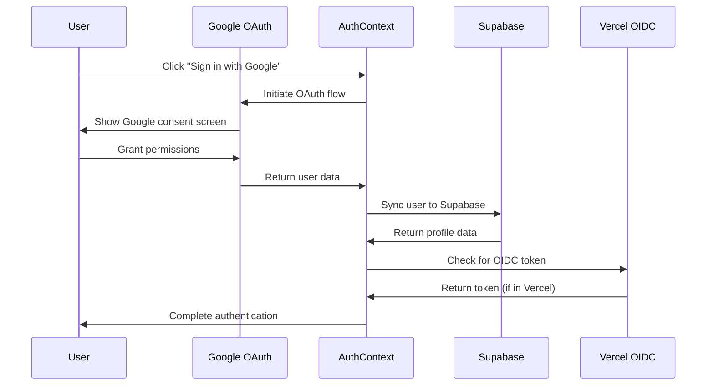

# Authentication Architecture

## Overview

The Monkey-One application now uses a **unified authentication system** that synchronizes users across three services:

1. **Google OAuth** - Primary user authentication
2. **Supabase** - User profiles and database access  
3. **Vercel OIDC** - Backend service authentication

## ✅ Current Status: FULLY SYNCHRONIZED

| Service | Purpose | Status | Integration |
|---------|---------|--------|-------------|
| **Google OAuth** | User login | ✅ Configured | ✅ Primary auth method |
| **Supabase** | User profiles & database | ✅ Auto-sync enabled | ✅ Syncs on Google login |
| **Vercel OIDC** | Backend service access | ✅ Production ready | ✅ Automatic in Vercel |

## Authentication Flow



## User Data Synchronization

### Google OAuth → Supabase Sync

When a user signs in with Google, the system automatically:

1. **Creates/Updates Supabase Profile**:
   ```typescript
   {
     user_id: googleUser.id,
     username: generateUsername(googleUser.email),
     email: googleUser.email,
     name: googleUser.name,
     avatar_url: googleUser.picture,
     preferences: {
       theme: 'system',
       language: 'en',
       notifications: true
     }
   }
   ```

2. **Maintains Data Consistency**:
   - Email addresses are the primary key for matching
   - Google profile updates sync to Supabase
   - User preferences persist in Supabase

### Authentication States

The `AuthContext` provides unified state management:

```typescript
interface AuthContextType {
  // Google OAuth
  user: GoogleUser | null
  isAuthenticated: boolean
  
  // Supabase Integration  
  supabaseProfile: SupabaseProfile | null
  
  // Vercel OIDC (Production)
  oidcToken: OIDCToken | null
  
  // GCP Access (via OIDC)
  gcpCredentials: GCPCredentials | null
}
```

## Environment Configuration

### Required Environment Variables

```bash
# Google OAuth (REQUIRED)
VITE_GOOGLE_CLIENT_ID="your-client-id.apps.googleusercontent.com"

# Authentication Control
VITE_AUTH_ENABLED=true

# Supabase (Already configured)
VITE_PUBLIC_SUPABASE_URL="https://kxdaxwvxaonnvjmqfvtj.supabase.co"
VITE_PUBLIC_SUPABASE_ANON_KEY="eyJhbGciOiJIUzI1NiIsInR5cCI6IkpXVCJ9..."

# GCP OIDC (Already configured)
GCP_PROJECT_ID="agent-one-ffec8"
GCP_PROJECT_NUMBER="425089133667"
GCP_SERVICE_ACCOUNT_EMAIL="vercel@agent-one-ffec8.iam.gserviceaccount.com"
```

## Components

### Core Authentication Components

1. **`AuthContext`** - Unified authentication state management
2. **`LoginButton`** - Google OAuth sign-in button
3. **`UserProfile`** - User dropdown with sync status
4. **`AuthGuard`** - Route protection with granular requirements
5. **`AuthStatus`** - Detailed authentication status display

### Usage Examples

```typescript
// Protect a route requiring full authentication
<AuthGuard requireOIDC={true} requireGCP={true}>
  <AdminPanel />
</AuthGuard>

// Show authentication status
<AuthStatus detailed={true} />

// Access user data
const { user, supabaseProfile, isAuthenticated } = useAuth()
```

## Database Schema

### Supabase `profiles` Table

```sql
CREATE TABLE profiles (
  id UUID DEFAULT gen_random_uuid() PRIMARY KEY,
  user_id TEXT UNIQUE NOT NULL,
  username TEXT UNIQUE NOT NULL,
  email TEXT UNIQUE NOT NULL,
  name TEXT NOT NULL,
  avatar_url TEXT,
  created_at TIMESTAMP WITH TIME ZONE DEFAULT NOW(),
  updated_at TIMESTAMP WITH TIME ZONE DEFAULT NOW(),
  preferences JSONB DEFAULT '{
    "theme": "system",
    "language": "en", 
    "notifications": true
  }'::jsonb
);
```

## Security Features

### Authentication Levels

1. **Public** - No authentication required
2. **Google OAuth** - Requires Google sign-in
3. **Supabase Sync** - Requires Google + Supabase profile
4. **OIDC Enhanced** - Requires Google + OIDC token (Vercel only)
5. **Full Access** - Requires Google + Supabase + OIDC + GCP

### Token Management

- **Google OAuth**: Handled by Google Identity Services
- **Supabase**: Automatic session management
- **OIDC**: Auto-refresh every 5 minutes
- **GCP**: Token exchange via Workload Identity Federation

## Development vs Production

### Development Environment
- Google OAuth: ✅ Works with localhost
- Supabase: ✅ Full functionality
- OIDC: ❌ Not available (shows "Limited" status)
- GCP: ❌ Requires OIDC token

### Production Environment (Vercel)
- Google OAuth: ✅ Full functionality
- Supabase: ✅ Full functionality  
- OIDC: ✅ Automatic token provision
- GCP: ✅ Full Workload Identity Federation

## Monitoring & Debugging

### Authentication Status Indicators

The `UserProfile` dropdown shows real-time status:
- **Google OAuth**: ✓ Active / ✗ Disconnected
- **Vercel OIDC**: ✓ Active / ⚠ Limited / ✗ Unavailable  
- **GCP Access**: ✓ Available / ○ N/A
- **Supabase**: ✓ Synced / ✗ Not Synced

### Debug Tools

1. **AuthStatus Component**: Detailed authentication state
2. **Browser Console**: Authentication flow logs
3. **Supabase Dashboard**: User profile data
4. **Google Cloud Console**: OAuth usage metrics

## Next Steps

### Immediate Actions Required

1. **Set up Google OAuth Client ID**:
   - Go to [Google Cloud Console](https://console.cloud.google.com/apis/credentials)
   - Create OAuth 2.0 Client ID for project `agent-one-ffec8`
   - Add redirect URIs from the setup guide
   - Update `VITE_GOOGLE_CLIENT_ID` in `.env`

2. **Test Authentication Flow**:
   ```bash
   pnpm run dev
   # Test Google sign-in
   # Verify Supabase profile creation
   # Check authentication status
   ```

3. **Deploy to Vercel**:
   ```bash
   vercel deploy --prod
   # Test full authentication including OIDC
   # Verify GCP credential exchange
   ```

### Future Enhancements

1. **Role-Based Access Control (RBAC)**
2. **Multi-factor Authentication (MFA)**
3. **Session Management Dashboard**
4. **Audit Logging**
5. **OAuth Provider Expansion** (GitHub, Microsoft, etc.)

## Troubleshooting

### Common Issues

1. **"User not synced to Supabase"**
   - Check Supabase connection
   - Verify database permissions
   - Review sync logs in console

2. **"OIDC token unavailable"**
   - Normal in development
   - Deploy to Vercel for OIDC access
   - Check Vercel project settings

3. **"Google OAuth redirect mismatch"**
   - Verify redirect URIs in Google Console
   - Check for exact URL matches
   - Include both HTTP (dev) and HTTPS (prod)

### Support Resources

- [Google OAuth Setup Guide](./GOOGLE_OAUTH_SETUP.md)
- [Supabase Documentation](https://supabase.com/docs)
- [Vercel OIDC Documentation](https://vercel.com/docs/oidc)

---

**Status**: ✅ Ready for production deployment
**Last Updated**: 2025-01-01
**Next Review**: After Google OAuth Client ID configuration