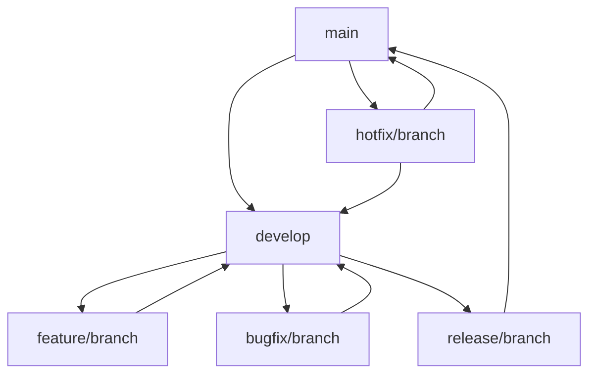

# Development Guide

## Table of Contents
1. [Development Environment Setup](#development-environment-setup)
2. [Development Workflow](#development-workflow)
3. [Code Review Process](#code-review-process)
4. [Testing Strategy](#testing-strategy)
5. [CI/CD Pipeline](#cicd-pipeline)
6. [Release Management](#release-management)

## Development Environment Setup

### Prerequisites

```bash
# Required versions
Node.js: v22.12.0
npm: 10.x
Git: 2.x
Docker: 24.x
Docker Compose: 2.x
```

### Initial Setup

1. **Clone and Install**
```bash
# Clone repository
git clone https://github.com/your-org/monkey-one.git
cd monkey-one

# Install dependencies
npm install

# Setup git hooks
npm run prepare
```

2. **Environment Configuration**
```bash
# Copy environment template
cp .env.example .env

# Generate development keys
npm run generate-keys

# Configure environment variables
nano .env
```

Example `.env` configuration:
```env
# App Configuration
NODE_ENV=development
PORT=3000
LOG_LEVEL=debug

# Database Configuration
DB_HOST=localhost
DB_PORT=5432
DB_NAME=monkey_one_dev
DB_USER=dev_user
DB_PASSWORD=dev_password

# Redis Configuration
REDIS_HOST=localhost
REDIS_PORT=6379

# JWT Configuration
JWT_SECRET=your-development-secret
JWT_EXPIRES_IN=1h

# API Configuration
API_RATE_LIMIT=100
API_RATE_WINDOW=900000
```

3. **Docker Development Environment**
```yaml
# docker-compose.dev.yml
version: '3.8'
services:
  app:
    build:
      context: .
      target: development
    volumes:
      - .:/usr/src/app
      - /usr/src/app/node_modules
    ports:
      - "3000:3000"
    environment:
      - NODE_ENV=development
    command: npm run dev

  postgres:
    image: postgres:14-alpine
    environment:
      POSTGRES_DB: monkey_one_dev
      POSTGRES_USER: dev_user
      POSTGRES_PASSWORD: dev_password
    ports:
      - "5432:5432"
    volumes:
      - postgres_data:/var/lib/postgresql/data

  redis:
    image: redis:alpine
    ports:
      - "6379:6379"

volumes:
  postgres_data:
```

### Development Tools

1. **VS Code Extensions**
```json
{
  "recommendations": [
    "dbaeumer.vscode-eslint",
    "esbenp.prettier-vscode",
    "ms-vscode.vscode-typescript-tslint-plugin",
    "streetsidesoftware.code-spell-checker",
    "eamodio.gitlens",
    "ms-azuretools.vscode-docker"
  ]
}
```

2. **Editor Configuration**
```editorconfig
# .editorconfig
root = true

[*]
end_of_line = lf
insert_final_newline = true
trim_trailing_whitespace = true
charset = utf-8

[*.{js,jsx,ts,tsx,json}]
indent_style = space
indent_size = 2

[*.md]
trim_trailing_whitespace = false
```

## Development Workflow

### 1. Branch Management



### 2. Git Workflow

```bash
# Create feature branch
git checkout develop
git pull origin develop
git checkout -b feature/new-feature

# Regular commits
git add .
git commit -m "feat: add new feature"

# Push feature branch
git push origin feature/new-feature

# Create pull request
gh pr create --base develop --head feature/new-feature
```

### 3. Commit Message Convention

```
type(scope): subject

body

footer
```

Types:
- feat: New feature
- fix: Bug fix
- docs: Documentation
- style: Code style changes
- refactor: Code refactoring
- test: Adding tests
- chore: Maintenance

Example:
```
feat(auth): implement JWT authentication

- Add JWT token generation
- Implement token validation
- Add refresh token functionality

Closes #123
```

## Code Review Process

### 1. Pull Request Template

```markdown
## Description
[Describe the changes made in this PR]

## Type of Change
- [ ] Bug fix
- [ ] New feature
- [ ] Breaking change
- [ ] Documentation update

## Testing
- [ ] Unit tests added/updated
- [ ] Integration tests added/updated
- [ ] Manual testing performed

## Checklist
- [ ] Code follows style guidelines
- [ ] Comments added for complex logic
- [ ] Documentation updated
- [ ] Tests passing
- [ ] PR title follows convention
```

### 2. Review Guidelines

```typescript
// Code Review Checklist
interface ReviewChecklist {
  functionality: [
    'Does the code work as intended?',
    'Are edge cases handled?',
    'Is error handling comprehensive?'
  ];
  
  security: [
    'Are inputs properly validated?',
    'Is authentication/authorization correct?',
    'Are sensitive data protected?'
  ];
  
  performance: [
    'Are there potential performance issues?',
    'Is caching used appropriately?',
    'Are database queries optimized?'
  ];
  
  maintainability: [
    'Is the code readable and well-documented?',
    'Are naming conventions followed?',
    'Is the code modular and reusable?'
  ];
}
```

## Testing Strategy

### 1. Test Structure

```typescript
// Test organization
describe('Component/Module Name', () => {
  describe('Functionality Name', () => {
    it('should behave in specific way', () => {
      // Test case
    });
  });
});

// Test utilities
export const createTestUser = async (
  overrides: Partial<User> = {}
): Promise<User> => {
  return User.create({
    username: 'test-user',
    email: 'test@example.com',
    password: 'password123',
    ...overrides
  });
};
```

### 2. Testing Levels

```typescript
// Unit Tests
describe('UserService', () => {
  it('should create user', async () => {
    const userData = {
      username: 'testuser',
      email: 'test@example.com'
    };
    
    const user = await UserService.create(userData);
    expect(user).toMatchObject(userData);
  });
});

// Integration Tests
describe('Authentication Flow', () => {
  it('should authenticate user', async () => {
    const response = await request(app)
      .post('/api/auth/login')
      .send({
        email: 'test@example.com',
        password: 'password123'
      });
    
    expect(response.status).toBe(200);
    expect(response.body).toHaveProperty('token');
  });
});

// E2E Tests
describe('User Registration Flow', () => {
  it('should register and login user', async () => {
    // Register user
    const registerResponse = await request(app)
      .post('/api/auth/register')
      .send(userData);
    
    expect(registerResponse.status).toBe(201);
    
    // Login user
    const loginResponse = await request(app)
      .post('/api/auth/login')
      .send(loginData);
    
    expect(loginResponse.status).toBe(200);
  });
});
```

## CI/CD Pipeline

### 1. GitHub Actions Workflow

```yaml
# .github/workflows/ci.yml
name: CI/CD Pipeline

on:
  push:
    branches: [ main, develop ]
  pull_request:
    branches: [ main, develop ]

jobs:
  test:
    runs-on: ubuntu-latest
    steps:
      - uses: actions/checkout@v3
      - uses: actions/setup-node@v3
        with:
          node-version: '22.12.0'
      
      - name: Install dependencies
        run: npm ci
      
      - name: Run linting
        run: npm run lint
      
      - name: Run tests
        run: npm test
      
      - name: Run build
        run: npm run build

  deploy:
    needs: test
    if: github.ref == 'refs/heads/main'
    runs-on: ubuntu-latest
    steps:
      - name: Deploy to production
        run: |
          echo "Deployment steps here"
```

### 2. Quality Gates

```typescript
// Quality gate thresholds
const qualityGates = {
  coverage: {
    lines: 80,
    functions: 80,
    branches: 75,
    statements: 80
  },
  
  complexity: {
    cyclomatic: 10,
    cognitive: 15
  },
  
  duplication: {
    lines: 3,
    blocks: 10
  },
  
  maintenance: {
    techDebt: 5 // %
  }
};
```

## Release Management

### 1. Version Control

```typescript
// Version management
interface Version {
  major: number; // Breaking changes
  minor: number; // New features
  patch: number; // Bug fixes
}

// Example version bumping
const bumpVersion = (
  current: Version,
  type: 'major' | 'minor' | 'patch'
): Version => {
  switch (type) {
    case 'major':
      return { major: current.major + 1, minor: 0, patch: 0 };
    case 'minor':
      return { ...current, minor: current.minor + 1, patch: 0 };
    case 'patch':
      return { ...current, patch: current.patch + 1 };
  }
};
```

### 2. Release Process

```bash
# Create release branch
git checkout develop
git pull origin develop
git checkout -b release/1.2.0

# Update version
npm version minor

# Create changelog
npm run generate-changelog

# Merge to main
git checkout main
git merge release/1.2.0
git tag -a v1.2.0 -m "Release 1.2.0"
git push origin main --tags

# Merge back to develop
git checkout develop
git merge release/1.2.0
git push origin develop
```

### 3. Deployment Checklist

```markdown
## Pre-deployment
- [ ] All tests passing
- [ ] Code review completed
- [ ] Documentation updated
- [ ] Change log generated
- [ ] Version bumped
- [ ] Security scan completed

## Deployment
- [ ] Database migrations ready
- [ ] Environment variables updated
- [ ] Backup completed
- [ ] Deploy to staging
- [ ] Smoke tests passed
- [ ] Deploy to production
- [ ] Health checks passing

## Post-deployment
- [ ] Monitor error rates
- [ ] Monitor performance metrics
- [ ] Verify critical flows
- [ ] Update status page
- [ ] Notify stakeholders
```
