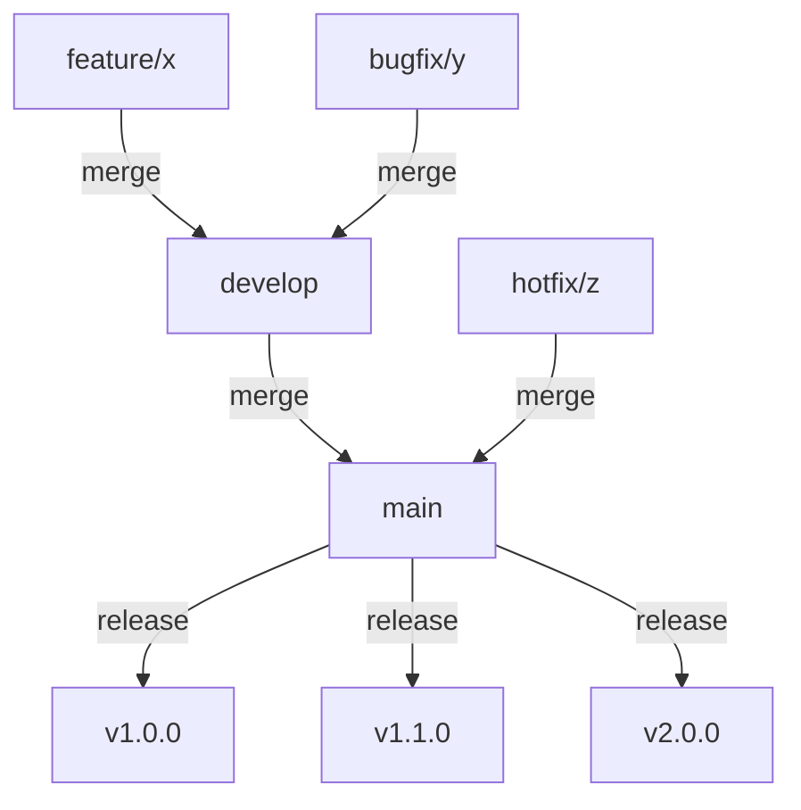

# Release Management Guide

## Overview
This document outlines the release management process for Monkey-One, including versioning, release procedures, and deployment strategies.

## Table of Contents
1. [Version Control](#version-control)
2. [Release Process](#release-process)
3. [Deployment Strategy](#deployment-strategy)
4. [Rollback Procedures](#rollback-procedures)
5. [Release Checklist](#release-checklist)

## Version Control

### Versioning Schema
We follow [Semantic Versioning](https://semver.org/) (MAJOR.MINOR.PATCH):

```typescript
interface Version {
  major: number; // Breaking changes
  minor: number; // New features (backwards compatible)
  patch: number; // Bug fixes (backwards compatible)
}
```

Example versions:
- 1.0.0 - Initial release
- 1.1.0 - New feature added
- 1.1.1 - Bug fix
- 2.0.0 - Breaking change

### Version Control Strategy



## Release Process

### 1. Pre-release Checklist

```bash
#!/bin/bash
# pre-release.sh

# Ensure we're on develop
git checkout develop
git pull origin develop

# Run tests
npm run test:all

# Run security checks
npm audit
npm run security-scan

# Check dependencies
npm outdated
npm run dependency-check

# Build documentation
npm run docs:build

# Run performance tests
npm run perf-test
```

### 2. Release Branch Creation

```bash
#!/bin/bash
# create-release.sh

VERSION=$1
BRANCH="release/$VERSION"

# Create release branch
git checkout -b $BRANCH develop

# Update version
npm version $VERSION --no-git-tag-version

# Update changelog
npm run generate-changelog

# Commit changes
git add package.json CHANGELOG.md
git commit -m "chore: prepare release $VERSION"

# Push branch
git push origin $BRANCH
```

### 3. Release Verification

```typescript
// Release verification steps
interface ReleaseVerification {
  automated: [
    'Unit tests',
    'Integration tests',
    'E2E tests',
    'Performance tests',
    'Security scans'
  ];
  
  manual: [
    'UI/UX verification',
    'Critical path testing',
    'Documentation review',
    'API compatibility check',
    'Database migration verification'
  ];
  
  deployment: [
    'Staging deployment',
    'Production dry run',
    'Backup verification',
    'Monitoring setup',
    'Alert configuration'
  ];
}
```

### 4. Release Finalization

```bash
#!/bin/bash
# finalize-release.sh

VERSION=$1
BRANCH="release/$VERSION"

# Merge to main
git checkout main
git merge --no-ff $BRANCH -m "chore: release $VERSION"

# Create tag
git tag -a "v$VERSION" -m "Release $VERSION"

# Merge to develop
git checkout develop
git merge --no-ff $BRANCH -m "chore: merge release $VERSION"

# Push changes
git push origin main develop "v$VERSION"

# Delete release branch
git branch -d $BRANCH
git push origin --delete $BRANCH
```

## Deployment Strategy

### 1. Deployment Environments

```typescript
interface DeploymentEnvironment {
  name: 'development' | 'staging' | 'production';
  url: string;
  configuration: {
    scaling: {
      min: number;
      max: number;
      target: number;
    };
    monitoring: {
      metrics: string[];
      alerts: Alert[];
    };
    backup: {
      frequency: string;
      retention: string;
    };
  };
}

const environments: DeploymentEnvironment[] = [
  {
    name: 'development',
    url: 'https://dev.monkey-one.com',
    configuration: {
      scaling: { min: 1, max: 2, target: 1 },
      monitoring: {
        metrics: ['errors', 'latency', 'throughput'],
        alerts: []
      },
      backup: {
        frequency: 'daily',
        retention: '7d'
      }
    }
  },
  {
    name: 'staging',
    url: 'https://staging.monkey-one.com',
    configuration: {
      scaling: { min: 2, max: 4, target: 2 },
      monitoring: {
        metrics: ['errors', 'latency', 'throughput', 'cpu', 'memory'],
        alerts: ['high-error-rate', 'high-latency']
      },
      backup: {
        frequency: 'daily',
        retention: '14d'
      }
    }
  },
  {
    name: 'production',
    url: 'https://monkey-one.com',
    configuration: {
      scaling: { min: 3, max: 10, target: 4 },
      monitoring: {
        metrics: ['errors', 'latency', 'throughput', 'cpu', 'memory', 'disk', 'network'],
        alerts: ['high-error-rate', 'high-latency', 'low-availability']
      },
      backup: {
        frequency: '6h',
        retention: '30d'
      }
    }
  }
];
```

### 2. Deployment Process

```typescript
interface DeploymentStep {
  name: string;
  action: () => Promise<void>;
  rollback: () => Promise<void>;
  verification: () => Promise<boolean>;
}

class Deployment {
  private steps: DeploymentStep[] = [];
  private currentStep: number = 0;

  async execute(): Promise<void> {
    for (const step of this.steps) {
      try {
        await step.action();
        const verified = await step.verification();
        
        if (!verified) {
          await this.rollback();
          throw new Error(`Verification failed for step: ${step.name}`);
        }
        
        this.currentStep++;
      } catch (error) {
        await this.rollback();
        throw error;
      }
    }
  }

  async rollback(): Promise<void> {
    for (let i = this.currentStep; i >= 0; i--) {
      await this.steps[i].rollback();
    }
  }
}
```

## Rollback Procedures

### 1. Quick Rollback

```bash
#!/bin/bash
# quick-rollback.sh

PREVIOUS_VERSION=$1

# Revert to previous version
git checkout "v$PREVIOUS_VERSION"

# Deploy previous version
npm run deploy

# Verify deployment
npm run verify-deployment

# Notify team
npm run notify-team "Rolled back to v$PREVIOUS_VERSION"
```

### 2. Database Rollback

```typescript
interface DatabaseRollback {
  backup: {
    path: string;
    timestamp: string;
    checksum: string;
  };
  
  migrations: {
    current: number;
    target: number;
    steps: string[];
  };
  
  verification: {
    queries: string[];
    expectedResults: any[];
  };
}

class DatabaseRollbackManager {
  async rollback(version: string): Promise<void> {
    // 1. Stop application
    await this.stopApplication();
    
    // 2. Restore database backup
    await this.restoreBackup(version);
    
    // 3. Verify data integrity
    await this.verifyData();
    
    // 4. Restart application
    await this.startApplication();
  }
}
```

## Release Checklist

### Pre-Release
- [ ] All tests passing
- [ ] Code review completed
- [ ] Documentation updated
- [ ] API documentation current
- [ ] Performance benchmarks acceptable
- [ ] Security scan passed
- [ ] Dependencies up to date
- [ ] Database migrations ready
- [ ] Backup strategy verified
- [ ] Monitoring configured

### Release
- [ ] Version bumped
- [ ] Changelog generated
- [ ] Release branch created
- [ ] Release notes prepared
- [ ] Staging deployment successful
- [ ] UAT completed
- [ ] Performance verified
- [ ] Security verified
- [ ] Backup completed
- [ ] Production deployment scheduled

### Post-Release
- [ ] Production deployment successful
- [ ] Monitoring active
- [ ] Alerts configured
- [ ] Documentation published
- [ ] Support team notified
- [ ] Users notified
- [ ] Release tagged
- [ ] Metrics baseline captured

### Emergency Procedures
- [ ] Rollback procedure tested
- [ ] Backup restoration verified
- [ ] Emergency contacts updated
- [ ] Incident response plan ready
- [ ] Communication templates prepared
