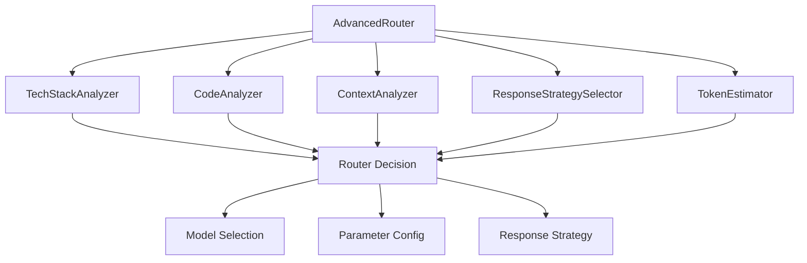
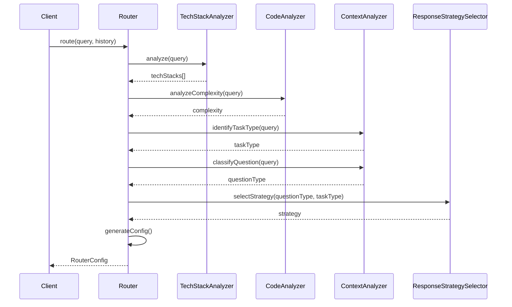
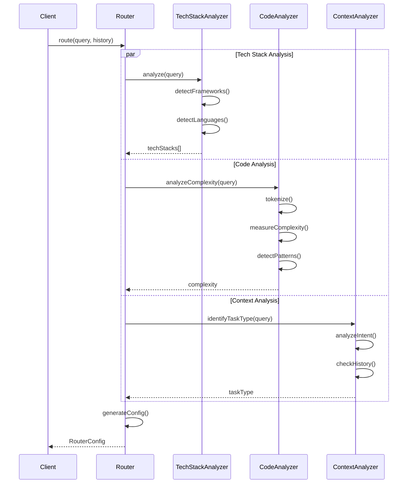
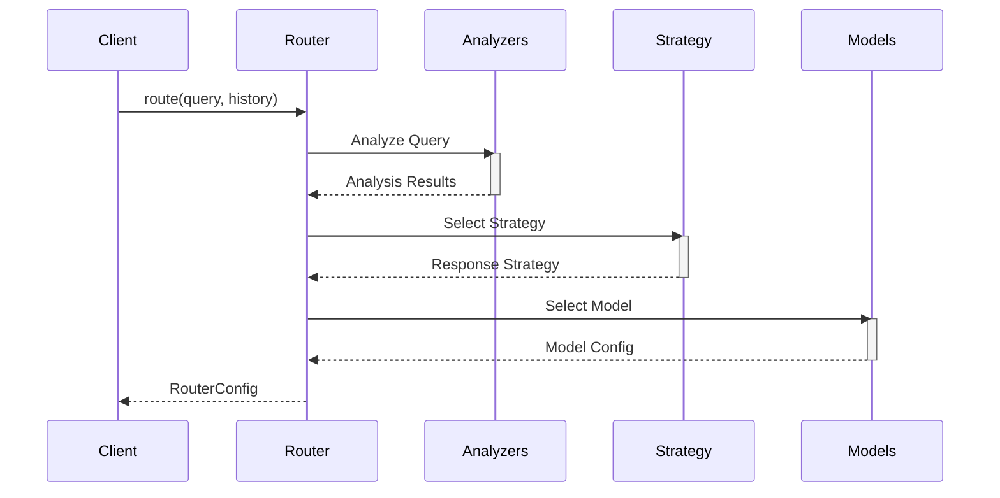
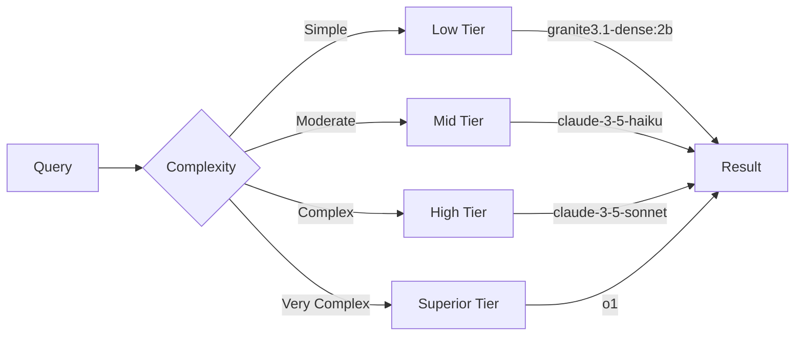
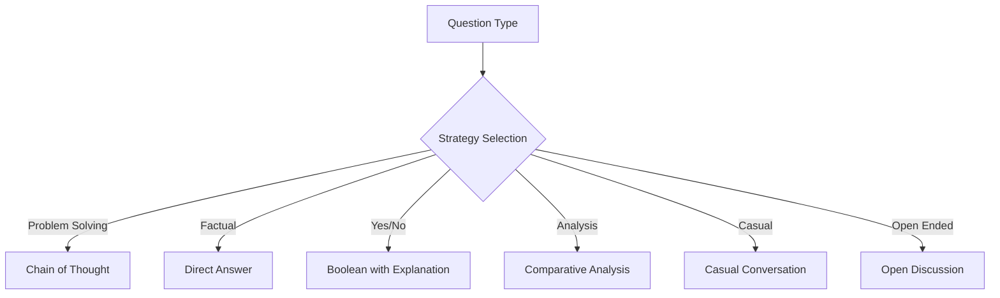

# Router System API Reference

## Architecture



## Type Definitions

```typescript
// Core Types
interface RouterConfig {
  modelId: string;
  parameters: ModelParameters;
  strategy: ResponseStrategy;
  contextWindow: number;
}

interface ModelParameters {
  temperature: number;
  topP: number;
  maxTokens: number;
  presencePenalty: number;
  frequencyPenalty: number;
}

interface XAIMessage {
  role: 'system' | 'user' | 'assistant';
  content: string;
  timestamp: string;
  metadata?: MessageMetadata;
}

interface MessageMetadata {
  taskId?: string;
  contextId?: string;
  indicators?: CodeIndicator[];
  techStacks?: TechStack[];
}

// Enums
enum TechStack {
  REACT = 'react',
  NODE = 'node',
  PYTHON = 'python',
  TYPESCRIPT = 'typescript',
  DOCKER = 'docker',
  KUBERNETES = 'kubernetes'
}

enum CodeIndicator {
  COMPLEXITY_HIGH = 'complexity_high',
  COMPLEXITY_MEDIUM = 'complexity_medium',
  COMPLEXITY_LOW = 'complexity_low',
  REQUIRES_OPTIMIZATION = 'requires_optimization',
  SECURITY_SENSITIVE = 'security_sensitive',
  PERFORMANCE_CRITICAL = 'performance_critical'
}

enum TaskType {
  CODE_GENERATION = 'code_generation',
  CODE_REVIEW = 'code_review',
  DEBUGGING = 'debugging',
  OPTIMIZATION = 'optimization',
  DOCUMENTATION = 'documentation',
  EXPLANATION = 'explanation'
}

enum QuestionType {
  FACTUAL = 'factual',
  CONCEPTUAL = 'conceptual',
  PROCEDURAL = 'procedural',
  PROBLEM_SOLVING = 'problem_solving'
}

enum ResponseStrategy {
  DETAILED = 'detailed',
  CONCISE = 'concise',
  STEP_BY_STEP = 'step_by_step',
  CODE_FOCUSED = 'code_focused',
  EXPLANATION_FOCUSED = 'explanation_focused'
}
```

## Core Components

### AdvancedRouter

Main router class that coordinates analysis and decision-making.

```typescript
class AdvancedRouter {
  constructor(config: RouterConfig);
  
  async route(query: string, history: XAIMessage[]): Promise<RouterConfig> {
    const techStacks = await TechStackAnalyzer.analyze(query);
    const codeComplexity = await CodeAnalyzer.analyzeComplexity(query);
    const taskType = await ContextAnalyzer.identifyTaskType(query);
    const questionType = await ContextAnalyzer.classifyQuestion(query);
    const strategy = await ResponseStrategySelector.selectStrategy(questionType, taskType);
    
    return this.generateConfig(techStacks, codeComplexity, taskType, strategy);
  }

  private generateConfig(
    techStacks: TechStack[],
    complexity: number,
    taskType: TaskType,
    strategy: ResponseStrategy
  ): RouterConfig;
}
```

### TechStackAnalyzer

```typescript
class TechStackAnalyzer {
  static async analyze(query: string): Promise<TechStack[]>;
  static hasTechStack(query: string, stack: TechStack): boolean;
  static getComplexityMultiplier(stacks: TechStack[]): number;
}
```

### CodeAnalyzer

```typescript
class CodeAnalyzer {
  static async analyzeComplexity(query: string): Promise<number>;
  static getIndicators(query: string): CodeIndicator[];
  static hasIndicator(query: string, indicator: CodeIndicator): boolean;
  static getIndicatorWeight(indicator: CodeIndicator): number;
}
```

### ContextAnalyzer

```typescript
class ContextAnalyzer {
  static async identifyTaskType(query: string): Promise<TaskType>;
  static async classifyQuestion(query: string): Promise<QuestionType>;
  static calculateContextLength(history: XAIMessage[]): number;
  static assessComplexity(query: string): number;
  static hasRapidExchanges(history: XAIMessage[]): boolean;
  static hasExplanationRequests(history: XAIMessage[]): boolean;
}
```

### ResponseStrategySelector

```typescript
class ResponseStrategySelector {
  static async selectStrategy(
    questionType: QuestionType,
    taskType: TaskType
  ): Promise<ResponseStrategy>;
  
  static getTokenMultiplier(strategy: ResponseStrategy): number;
  
  static adjustStrategy(
    strategy: ResponseStrategy,
    contextLength: number,
    isRapidExchange: boolean
  ): ResponseStrategy;
}
```

## Sequence Diagrams

### Basic Routing Flow



### Complex Analysis Flow



## Performance Considerations

1. **Caching Strategy**
   - Cache analysis results
   - Cache common patterns
   - Store frequent configurations

2. **Optimization Techniques**
   - Parallel analysis when possible
   - Early termination for simple queries
   - Progressive complexity analysis

3. **Resource Management**
   - Token usage optimization
   - Memory-efficient processing
   - Background task scheduling

## Error Handling

```typescript
class RouterError extends Error {
  constructor(
    message: string,
    public code: string,
    public details?: object
  ) {
    super(message);
  }
}

// Error handling example
try {
  const config = await router.route(query, history);
} catch (error) {
  if (error instanceof RouterError) {
    console.error(`Router error: ${error.code} - ${error.message}`);
    // Handle specific error cases
  }
}
```

## Data Flow



## Model Tiers



## Response Strategies



## Usage Examples

### Basic Usage

```typescript
import { AdvancedRouter } from './lib/router';

const router = new AdvancedRouter();
const config = await router.route('How do I use React hooks?', []);

console.log(config);
// {
//   model: { id: 'llama-3.3-70b', ... },
//   maxTokens: 1024,
//   temperature: 0.7,
//   responseStrategy: 'chain_of_thought',
//   ...
// }
```

### With Context

```typescript
const history = [
  { role: 'user', content: 'What is TypeScript?' },
  { role: 'assistant', content: 'TypeScript is a typed superset...' },
];

const config = await router.route(
  'How do I implement a generic interface?',
  history
);
```

### With Token Estimation

```typescript
import { TokenEstimator } from './lib/tokenEstimator';

const estimate = TokenEstimator.estimateConversationTokens(
  history,
  'coding',
  'chain_of_thought'
);

if (TokenEstimator.isApproachingContextLimit(estimate, 8192)) {
  // Handle context limit
}
```
