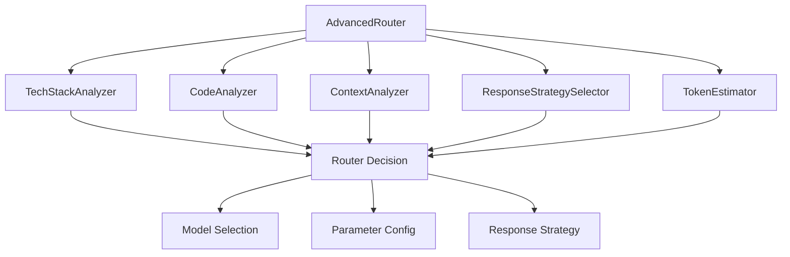
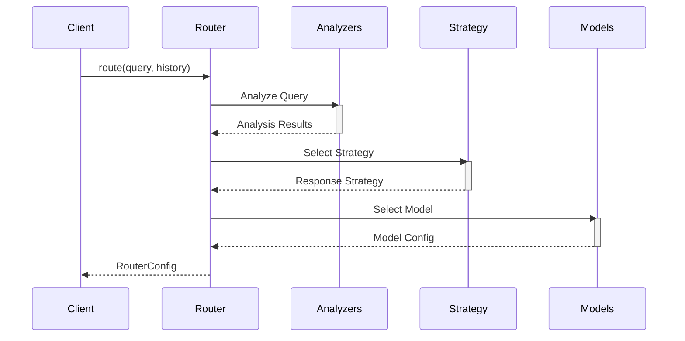
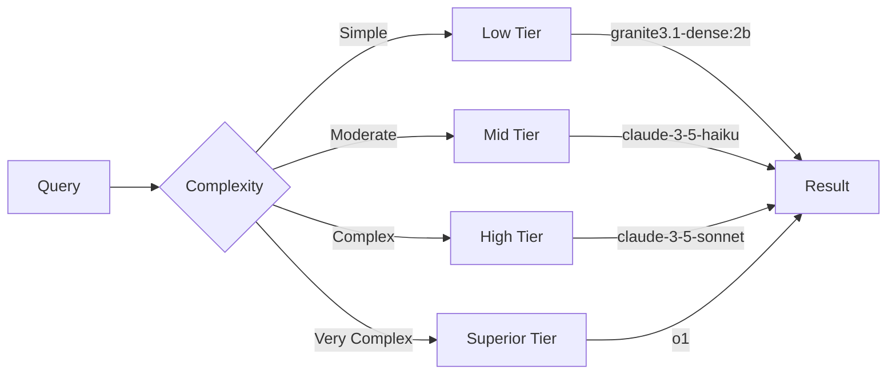
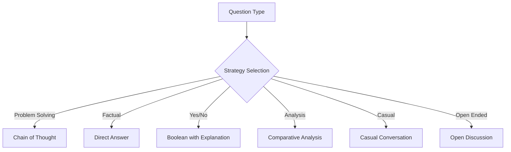

# Router System API Reference

## Architecture



## Core Components

### AdvancedRouter

Main router class that coordinates analysis and decision-making.

```typescript
class AdvancedRouter {
  constructor(threshold?: number);
  route(query: string, history: XAIMessage[]): RouterConfig;
}
```

### TechStackAnalyzer

Analyzes queries for technology stack references.

```typescript
class TechStackAnalyzer {
  static analyze(query: string): TechStack[];
  static hasTechStack(query: string, stack: TechStack): boolean;
  static getComplexityMultiplier(stacks: TechStack[]): number;
}
```

### CodeAnalyzer

Analyzes code complexity and patterns.

```typescript
class CodeAnalyzer {
  static analyzeComplexity(query: string): number;
  static getIndicators(query: string): CodeIndicator[];
  static hasIndicator(query: string, indicator: CodeIndicator): boolean;
  static getIndicatorWeight(indicator: CodeIndicator): number;
}
```

### ContextAnalyzer

Analyzes conversation context and query characteristics.

```typescript
class ContextAnalyzer {
  static identifyTaskType(query: string): TaskType;
  static classifyQuestion(query: string): QuestionType;
  static calculateContextLength(history: XAIMessage[]): number;
  static assessComplexity(query: string): number;
  static hasRapidExchanges(history: XAIMessage[]): boolean;
  static hasExplanationRequests(history: XAIMessage[]): boolean;
}
```

### ResponseStrategySelector

Selects and adjusts response strategies.

```typescript
class ResponseStrategySelector {
  static selectStrategy(
    questionType: QuestionType,
    taskType: TaskType
  ): ResponseStrategy;
  static getTokenMultiplier(strategy: ResponseStrategy): number;
  static adjustStrategy(
    strategy: ResponseStrategy,
    contextLength: number,
    isRapidExchange: boolean
  ): ResponseStrategy;
}
```

## Data Flow



## Types

### RouterConfig

Configuration for processing a query.

```typescript
interface RouterConfig {
  model: ModelConfig;
  maxTokens: number;
  temperature: number;
  responseStrategy: ResponseStrategy;
  routingExplanation: string;
  questionType?: QuestionType;
}
```

### TokenEstimate

Token usage estimation.

```typescript
interface TokenEstimate {
  promptTokens: number;
  expectedResponseTokens: number;
  totalTokens: number;
}
```

### RouterContext

Context information for routing decisions.

```typescript
interface RouterContext {
  complexity: number;
  contextLength: number;
  taskType: TaskType;
  questionType: QuestionType;
  techStack: TechStack[];
  codeComplexity: number;
}
```

## Model Tiers



## Response Strategies



## Error Handling

The system implements comprehensive error handling:

```typescript
try {
  const config = router.route(query, history);
} catch (error) {
  if (error instanceof RouterError) {
    // Handle routing-specific errors
  } else if (error instanceof ModelError) {
    // Handle model-specific errors
  } else {
    // Handle unexpected errors
  }
}
```

## Performance Optimization

The router implements several optimization strategies:

1. **Caching**
   - Tech stack detection results
   - Code complexity scores
   - Token estimates

2. **Early Returns**
   - Quick response for casual queries
   - Cached results when available
   - Simple queries to efficient models

3. **Parallel Processing**
   - Concurrent analysis when possible
   - Async token estimation
   - Background complexity calculation

## Usage Examples

### Basic Usage

```typescript
import { AdvancedRouter } from './lib/router';

const router = new AdvancedRouter();
const config = router.route('How do I use React hooks?', []);

console.log(config);
// {
//   model: { id: 'llama-3.3-70b', ... },
//   maxTokens: 1024,
//   temperature: 0.7,
//   responseStrategy: 'chain_of_thought',
//   ...
// }
```

### With Context

```typescript
const history = [
  { role: 'user', content: 'What is TypeScript?' },
  { role: 'assistant', content: 'TypeScript is a typed superset...' },
];

const config = router.route(
  'How do I implement a generic interface?',
  history
);
```

### With Token Estimation

```typescript
import { TokenEstimator } from './lib/tokenEstimator';

const estimate = TokenEstimator.estimateConversationTokens(
  history,
  'coding',
  'chain_of_thought'
);

if (TokenEstimator.isApproachingContextLimit(estimate, 8192)) {
  // Handle context limit
}
```
