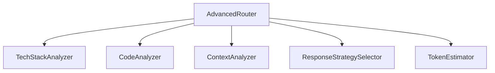

# Monkey-One Project Design Approach

## Architecture Overview

### Core Technology Stack

- **Frontend**: React + TypeScript + Vite
- **State Management**: React Context + Custom Hooks
- **Styling**: Tailwind CSS with custom components
- **Database**: Supabase (PostgreSQL)
- **Vector Storage**: Pinecone
- **Authentication**: Supabase Auth
- **Deployment**: Vercel

### Design System

#### 1. Typography

- **Primary Font**: Inter (body text, UI elements)
- **Secondary Font**: JetBrains Mono (code blocks)
- **Scale**:
  - xs: 0.75rem (12px)
  - sm: 0.875rem (14px)
  - base: 1rem (16px)
  - lg: 1.125rem (18px)
  - xl: 1.25rem (20px)
  - 2xl: 1.5rem (24px)

#### 2. Color Palette

- **Primary**:
  - Blue: #3B82F6
  - Indigo: #6366F1
- **Neutral**:
  - Gray-50: #F9FAFB
  - Gray-100: #F3F4F6
  - Gray-800: #1F2937
  - Gray-900: #111827
- **Accent**:
  - Green: #10B981
  - Red: #EF4444
  - Yellow: #F59E0B
- **Theme Variables**:
  - --bg-primary
  - --text-primary
  - --border-color

#### 3. Shapes & Components

- **Border Radius**:
  - sm: 0.125rem (2px)
  - default: 0.25rem (4px)
  - md: 0.375rem (6px)
  - lg: 0.5rem (8px)
  - full: 9999px
- **Shadows**:
  - sm: 0 1px 2px rgba(0, 0, 0, 0.05)
  - default: 0 1px 3px rgba(0, 0, 0, 0.1)
  - md: 0 4px 6px rgba(0, 0, 0, 0.1)
  - lg: 0 10px 15px rgba(0, 0, 0, 0.1)
- **Component Shapes**:
  - Cards: rounded-lg with shadow-md
  - Buttons: rounded with hover effects
  - Inputs: rounded with consistent padding
  - Panels: rounded-lg with shadow-lg

## Key System Components

### 1. Router System

The project implements a sophisticated routing system with:

- Model tier selection based on complexity
- Response strategy selection
- Context analysis
- Technical stack analysis



### 2. Panel-Based UI Architecture

- Dashboard Panel (metrics & monitoring)
- Agents Panel (management interface)
- Memory Panel (vector storage)
- Documents Panel (file management)
- Search Panel (advanced search)
- Workflow Panel (automation)

### 3. Core Features

1. **Intelligent Routing**
   - Multi-tier model selection
   - Adaptive response strategies
   - Context-aware processing

2. **State Management**

```typescript
interface AppState {
  theme: 'light' | 'dark';
  panels: Record<string, PanelState>;
  user: UserState;
}
```

3. **UI/UX Priorities**
   - Responsive design
   - Real-time updates
   - Accessibility compliance
   - Performance optimization
   - Theme support (light/dark)

## Development Principles

### 1. Code Organization

- Component-based architecture
- Modular design
- Clean separation of concerns
- Type-safe implementations

### 2. Performance Optimization

- Code splitting
- Lazy loading
- Memoized selectors
- Optimized renders
- Efficient state management

### 3. Security Measures

- Supabase Authentication
- Row Level Security
- Data encryption
- Secure communication
- Environment protection
